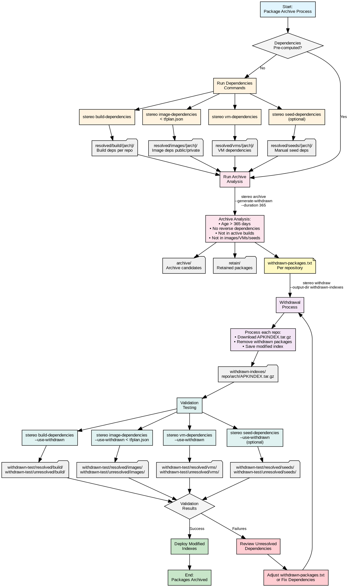

# Stereo Archive Process - Complete Workflow

## Key Process Phases

1. **Dependencies Resolution** (Orange): Pre-compute all package dependencies
2. **Archive Analysis** (Pink): Identify packages for archival based on criteria
3. **Withdrawal** (Purple): Create modified APKINDEX files with packages removed
4. **Validation** (Green): Test dependency resolution with withdrawn packages