# Stereo Dependencies Resolution Phase

```dot
digraph dependencies {
    rankdir=TD;
    node [shape=box, style=filled, fontname="Arial", fontsize=10];
    edge [fontname="Arial", fontsize=9];
    compound=true;

    // Repositories cluster
    subgraph cluster_repos {
        label="Repositories";
        style=filled;
        fillcolor="#f9f9f9";

        R1 [label="os\npackages.wolfi.dev/os", fillcolor="#e8f5e8"];
        R2 [label="extra-packages\npackages.cgr.dev/extras", fillcolor="#e8f5e8"];
        R3 [label="enterprise-packages\napk.cgr.dev/chainguard-private", fillcolor="#e8f5e8"];
    }

    // Architecture cluster
    subgraph cluster_arch {
        label="Architecture Support";
        style=filled;
        fillcolor="#f9f9f9";

        A1 [label="x86_64\n(default)", fillcolor="#fff3e0"];
        A2 [label="aarch64\n(default)", fillcolor="#fff3e0"];
        A3 [label="Single Architecture\n(--arch flag)", fillcolor="#fff3e0"];
    }

    // Build Dependencies cluster
    subgraph cluster_build {
        label="Build Dependencies";
        style=filled;
        fillcolor="#e3f2fd";

        BD [label="stereo build-dependencies", fillcolor="#e3f2fd"];
        BD1 [label="Scan melange YAML configs\nacross all repos", fillcolor="#e3f2fd"];
        BD2 [label="Respect target-architecture\nconstraints", fillcolor="#e3f2fd"];
        BD3 [label="Resolve build deps using\nAPK cache + lockBuildDependencies", fillcolor="#e3f2fd"];
        BD4 [label="resolved/build/{arch}/\nper repository JSON files", shape=folder, fillcolor="#f0f0f0"];

        BD -> BD1 -> BD2 -> BD3 -> BD4;
    }

    // Image Dependencies cluster
    subgraph cluster_image {
        label="Image Dependencies";
        style=filled;
        fillcolor="#f1f8e9";

        ID [label="stereo image-dependencies", fillcolor="#f1f8e9"];
        ID1 [label="Read Terraform JSON\nfrom stdin", fillcolor="#f1f8e9"];
        ID2 [label="Extract apko_build\nconfigurations", fillcolor="#f1f8e9"];
        ID3 [label="Respect archs constraints\nx86_64↔amd64, aarch64↔arm64", fillcolor="#f1f8e9"];
        ID4 [label="Resolve runtime deps using\napko LockImageConfiguration", fillcolor="#f1f8e9"];
        ID5 [label="resolved/images/{arch}/\npublic/private JSON files", shape=folder, fillcolor="#f0f0f0"];

        ID -> ID1 -> ID2 -> ID3 -> ID4 -> ID5;
    }

    // VM Dependencies cluster
    subgraph cluster_vm {
        label="VM Dependencies";
        style=filled;
        fillcolor="#fff8e1";

        VD [label="stereo vm-dependencies", fillcolor="#fff8e1"];
        VD1 [label="Scan wolfi-vm/configs/\n**/build.yaml", fillcolor="#fff8e1"];
        VD2 [label="Extract APKO configs\nrespect archs constraints", fillcolor="#fff8e1"];
        VD3 [label="Resolve VM deps using\napko LockImageConfiguration", fillcolor="#fff8e1"];
        VD4 [label="resolved/vms/{arch}/\nVM configuration JSON files", shape=folder, fillcolor="#f0f0f0"];

        VD -> VD1 -> VD2 -> VD3 -> VD4;
    }

    // Seed Dependencies cluster
    subgraph cluster_seed {
        label="Seed Dependencies (Optional)";
        style=filled;
        fillcolor="#fce4ec";

        SD [label="stereo seed-dependencies\n(optional)", fillcolor="#fce4ec"];
        SD1 [label="Read archive-seeds.json\nmanual seed packages", fillcolor="#fce4ec"];
        SD2 [label="Create minimal APKO configs\nper seed package", fillcolor="#fce4ec"];
        SD3 [label="Resolve seed deps using\nlockImageDependencies", fillcolor="#fce4ec"];
        SD4 [label="resolved/seeds/{arch}/\naggregated + detailed deps", shape=folder, fillcolor="#f0f0f0"];

        SD -> SD1 -> SD2 -> SD3 -> SD4;
    }


    // Processing cluster
    subgraph cluster_processing {
        label="Concurrent Processing";
        style=filled;
        fillcolor="#f3e5f5";

        CP [label="errgroup.Group\nParallel Processing", fillcolor="#f3e5f5"];
        CP1 [label="Multi-repo scanning", fillcolor="#f3e5f5"];
        CP2 [label="Multi-architecture resolution", fillcolor="#f3e5f5"];
        CP3 [label="Dependency graph building", fillcolor="#f3e5f5"];

        CP -> CP1;
        CP -> CP2;
        CP -> CP3;
    }

    // Output clusters
    subgraph cluster_resolved {
        label="Successfully Resolved";
        style=filled;
        fillcolor="#c8e6c9";

        OS [label="resolved/", fillcolor="#c8e6c9"];
        OS1 [label="build/{arch}/\nBuild dependencies", shape=folder, fillcolor="#f0f0f0"];
        OS2 [label="images/{arch}/\nImage dependencies", shape=folder, fillcolor="#f0f0f0"];
        OS3 [label="vms/{arch}/\nVM dependencies", shape=folder, fillcolor="#f0f0f0"];
        OS4 [label="seeds/{arch}/\nSeed dependencies", shape=folder, fillcolor="#f0f0f0"];

        OS -> OS1;
        OS -> OS2;
        OS -> OS3;
        OS -> OS4;
    }

    subgraph cluster_unresolved {
        label="Failed Resolutions";
        style=filled;
        fillcolor="#ffcdd2";

        US [label="unresolved/", fillcolor="#ffcdd2"];
        US1 [label="build/{arch}/\nFailed builds", shape=folder, fillcolor="#f0f0f0"];
        US2 [label="images/{arch}/\nFailed images", shape=folder, fillcolor="#f0f0f0"];
        US3 [label="vms/{arch}/\nFailed VMs", shape=folder, fillcolor="#f0f0f0"];
        US4 [label="seeds/{arch}/\nFailed seeds", shape=folder, fillcolor="#f0f0f0"];

        US -> US1;
        US -> US2;
        US -> US3;
        US -> US4;
    }

    // Cross-cluster connections
    R1 -> BD1 [ltail=cluster_repos, lhead=cluster_build];
    R2 -> BD1 [ltail=cluster_repos, lhead=cluster_build];
    R3 -> BD1 [ltail=cluster_repos, lhead=cluster_build];

    A1 -> BD [ltail=cluster_arch, lhead=cluster_build];
    A1 -> ID [ltail=cluster_arch, lhead=cluster_image];
    A1 -> VD [ltail=cluster_arch, lhead=cluster_vm];

    CP -> BD [ltail=cluster_processing, lhead=cluster_build];
    CP -> ID [ltail=cluster_processing, lhead=cluster_image];
    CP -> VD [ltail=cluster_processing, lhead=cluster_vm];

    BD4 -> OS1 [ltail=cluster_build, lhead=cluster_resolved];
    ID5 -> OS2 [ltail=cluster_image, lhead=cluster_resolved];
    VD4 -> OS3 [ltail=cluster_vm, lhead=cluster_resolved];
    SD4 -> OS4 [ltail=cluster_seed, lhead=cluster_resolved];
}
```

## Key Features

**Multi-Architecture Support:**
- Default: Both x86_64 and aarch64
- Single arch: Use `--arch` flag
- Architecture mapping: x86_64↔amd64, aarch64↔arm64

**Constraint Handling:**
- Melange: `target-architecture` lists
- APKO/VMs: `archs` configuration limits

**Performance:**
- Concurrent processing with `errgroup.Group`
- APK cache utilization
- Architecture-specific dependency resolution