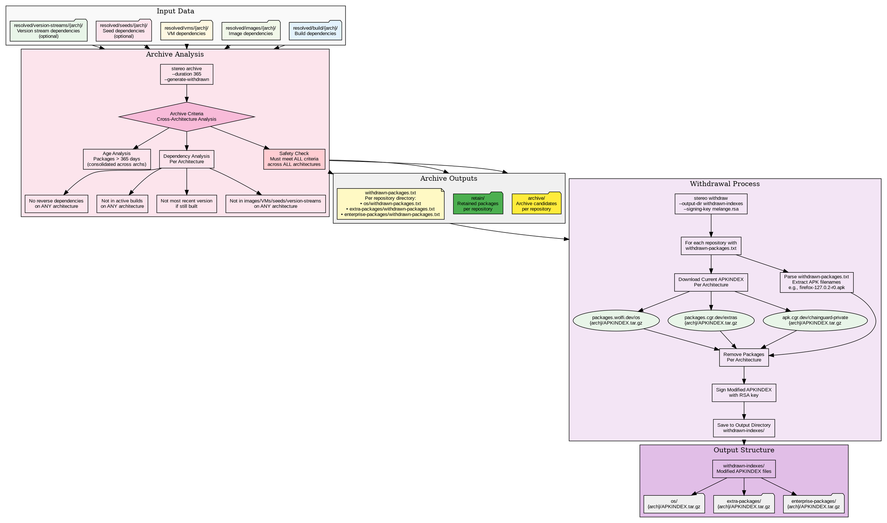

# Stereo Archive Analysis and Withdrawal Process

## Archive Decision Matrix

| Criteria | Check Scope | Result |
|----------|-------------|---------|
| Age > 365 days | Consolidated across architectures | ✅ Archive candidate |
| No reverse deps | **ALL** architectures | ✅ Safe to remove |
| Not in active builds | **ALL** architectures | ✅ Won't break builds |
| Not most recent version | If still built | ✅ Keep latest only |
| Not in images/VMs/seeds/version-streams | **ALL** architectures | ✅ Won't break deployments |

**Key Safety Feature:** Packages only archived if criteria met across **ALL** supported architectures