# Stereo Validation Testing with --use-withdrawn

```dot
digraph validation_testing {
    rankdir=TD;
    node [shape=box, style=filled, fontname="Arial", fontsize=10];
    edge [fontname="Arial", fontsize=9];
    compound=true;

    // Modified Indexes cluster
    subgraph cluster_indexes {
        label="Modified Indexes";
        style=filled;
        fillcolor="#f9f9f9";

        MI [label="withdrawn-indexes/\nModified APKINDEX files", fillcolor="#e1bee7"];
        MI1 [label="os/{arch}/APKINDEX.tar.gz\n(packages removed)", shape=folder, fillcolor="#ffcdd2"];
        MI2 [label="extra-packages/{arch}/APKINDEX.tar.gz\n(packages removed)", shape=folder, fillcolor="#ffcdd2"];
        MI3 [label="enterprise-packages/{arch}/APKINDEX.tar.gz\n(packages removed)", shape=folder, fillcolor="#ffcdd2"];

        MI -> MI1;
        MI -> MI2;
        MI -> MI3;
    }

    // Build Validation cluster
    subgraph cluster_build_validation {
        label="Build Validation";
        style=filled;
        fillcolor="#e3f2fd";

        BV [label="stereo build-dependencies\n--use-withdrawn\n--withdrawn-dir withdrawn-indexes", fillcolor="#e3f2fd"];
        BV1 [label="Use local APKINDEX files\ninstead of live repositories", fillcolor="#e3f2fd"];
        BV2 [label="Attempt to resolve\nbuild dependencies", fillcolor="#e3f2fd"];
        BV3 [label="Resolution Success?", shape=diamond, fillcolor="#bbdefb"];
        BV4 [label="withdrawn-test/resolved/\nbuild/{arch}/", shape=folder, fillcolor="#c8e6c9"];
        BV5 [label="withdrawn-test/unresolved/\nbuild/{arch}/", shape=folder, fillcolor="#ffcdd2"];

        BV -> BV1 -> BV2 -> BV3;
        BV3 -> BV4 [label="Success"];
        BV3 -> BV5 [label="Failure"];
    }

    // Image Validation cluster
    subgraph cluster_image_validation {
        label="Image Validation";
        style=filled;
        fillcolor="#f1f8e9";

        IV [label="stereo image-dependencies\n--use-withdrawn\n--withdrawn-dir withdrawn-indexes\n< tfplan.json", fillcolor="#f1f8e9"];
        IV1 [label="Use local APKINDEX files\nfor dependency resolution", fillcolor="#f1f8e9"];
        IV2 [label="Attempt to resolve\nimage dependencies", fillcolor="#f1f8e9"];
        IV3 [label="Resolution Success?", shape=diamond, fillcolor="#dcedc8"];
        IV4 [label="withdrawn-test/resolved/\nimages/{arch}/", shape=folder, fillcolor="#c8e6c9"];
        IV5 [label="withdrawn-test/unresolved/\nimages/{arch}/", shape=folder, fillcolor="#ffcdd2"];

        IV -> IV1 -> IV2 -> IV3;
        IV3 -> IV4 [label="Success"];
        IV3 -> IV5 [label="Failure"];
    }

    // VM Validation cluster
    subgraph cluster_vm_validation {
        label="VM Validation";
        style=filled;
        fillcolor="#fff8e1";

        VV [label="stereo vm-dependencies\n--use-withdrawn\n--withdrawn-dir withdrawn-indexes", fillcolor="#fff8e1"];
        VV1 [label="Use local APKINDEX files\nfor VM dependency resolution", fillcolor="#fff8e1"];
        VV2 [label="Attempt to resolve\nVM dependencies", fillcolor="#fff8e1"];
        VV3 [label="Resolution Success?", shape=diamond, fillcolor="#fff3e0"];
        VV4 [label="withdrawn-test/resolved/\nvms/{arch}/", shape=folder, fillcolor="#c8e6c9"];
        VV5 [label="withdrawn-test/unresolved/\nvms/{arch}/", shape=folder, fillcolor="#ffcdd2"];

        VV -> VV1 -> VV2 -> VV3;
        VV3 -> VV4 [label="Success"];
        VV3 -> VV5 [label="Failure"];
    }

    // Seed Validation cluster
    subgraph cluster_seed_validation {
        label="Seed Validation (Optional)";
        style=filled;
        fillcolor="#fce4ec";

        SV [label="stereo seed-dependencies\n--use-withdrawn\n--withdrawn-dir withdrawn-indexes\n(optional)", fillcolor="#fce4ec"];
        SV1 [label="Use local APKINDEX files\nfor seed dependency resolution", fillcolor="#fce4ec"];
        SV2 [label="Attempt to resolve\nseed dependencies", fillcolor="#fce4ec"];
        SV3 [label="Resolution Success?", shape=diamond, fillcolor="#f8bbd9"];
        SV4 [label="withdrawn-test/resolved/\nseeds/{arch}/", shape=folder, fillcolor="#c8e6c9"];
        SV5 [label="withdrawn-test/unresolved/\nseeds/{arch}/", shape=folder, fillcolor="#ffcdd2"];

        SV -> SV1 -> SV2 -> SV3;
        SV3 -> SV4 [label="Success"];
        SV3 -> SV5 [label="Failure"];
    }
    
    // Version Stream Info - Not Tested
    VSInfo [label="version-stream-dependencies\nNOT included in validation:\nversion streams work differently\n(keeps latest versions per stream)", 
            shape=note, fillcolor="#fff9c4", style="dashed"];

    // Test Results Analysis cluster
    subgraph cluster_analysis {
        label="Test Results Analysis";
        style=filled;
        fillcolor="#f0f0f0";

        TRA [label="Analysis Phase", fillcolor="#f0f0f0"];
        TRA1 [label="All Dependencies\nResolve Successfully?", shape=diamond, fillcolor="#e0e0e0"];
        TRA2 [label="✅ Safe to Deploy\nModified APKINDEX files", fillcolor="#c8e6c9"];
        TRA3 [label="❌ Issues Detected\nReview unresolved dependencies", fillcolor="#ffcdd2"];
        TRA4 [label="Investigate Failures:\n• Missing packages\n• Broken dependency chains\n• Critical packages withdrawn", fillcolor="#ffcdd2"];
        TRA5 [label="Fix Strategy", shape=diamond, fillcolor="#ffcdd2"];
        TRA6 [label="Modify withdrawn-packages.txt\nRemove problematic packages", fillcolor="#fff3e0"];
        TRA7 [label="Update configurations\nAdd alternative dependencies", fillcolor="#fff3e0"];
        TRA8 [label="Re-run Withdrawal Process", fillcolor="#f3e5f5"];

        TRA -> TRA1;
        TRA1 -> TRA2 [label="Yes"];
        TRA1 -> TRA3 [label="No"];
        TRA3 -> TRA4 -> TRA5;
        TRA5 -> TRA6 [label="Adjust Lists"];
        TRA5 -> TRA7 [label="Fix Dependencies"];
        TRA6 -> TRA8;
        TRA7 -> TRA8;
    }

    // Output Comparison cluster
    subgraph cluster_comparison {
        label="Output Comparison";
        style=filled;
        fillcolor="#e8f5e8";

        OC [label="Test vs Normal Comparison", fillcolor="#e8f5e8"];
        OC1 [label="Compare withdrawn-test/\nvs resolved/", fillcolor="#e8f5e8"];
        OC2 [label="Identify Impact:\n• Previously working configs\n• Now failing dependencies\n• Alternative package paths", fillcolor="#e8f5e8"];

        OC -> OC1 -> OC2;
    }

    // Cross-cluster connections
    MI1 -> BV1 [ltail=cluster_indexes, lhead=cluster_build_validation];
    MI1 -> IV1 [ltail=cluster_indexes, lhead=cluster_image_validation];
    MI1 -> VV1 [ltail=cluster_indexes, lhead=cluster_vm_validation];
    MI1 -> SV1 [ltail=cluster_indexes, lhead=cluster_seed_validation];

    BV4 -> TRA1 [ltail=cluster_build_validation, lhead=cluster_analysis];
    BV5 -> TRA1 [ltail=cluster_build_validation, lhead=cluster_analysis];
    IV4 -> TRA1 [ltail=cluster_image_validation, lhead=cluster_analysis];
    IV5 -> TRA1 [ltail=cluster_image_validation, lhead=cluster_analysis];
    VV4 -> TRA1 [ltail=cluster_vm_validation, lhead=cluster_analysis];
    VV5 -> TRA1 [ltail=cluster_vm_validation, lhead=cluster_analysis];
    SV4 -> TRA1 [ltail=cluster_seed_validation, lhead=cluster_analysis];
    SV5 -> TRA1 [ltail=cluster_seed_validation, lhead=cluster_analysis];

    BV4 -> OC1 [ltail=cluster_build_validation, lhead=cluster_comparison];
    IV4 -> OC1 [ltail=cluster_image_validation, lhead=cluster_comparison];
    VV4 -> OC1 [ltail=cluster_vm_validation, lhead=cluster_comparison];
    SV4 -> OC1 [ltail=cluster_seed_validation, lhead=cluster_comparison];

    // Feedback loop
    TRA8 -> BV [ltail=cluster_analysis, lhead=cluster_build_validation];
}
```

## Validation Process Benefits

**Risk Mitigation:**
- Test impact before production deployment
- Identify critical dependency breaks
- Validate alternative package paths

**Output Isolation:**
- `withdrawn-test/` directory prevents overwriting normal results
- Side-by-side comparison with baseline dependencies
- Architecture-specific failure analysis

**Iterative Refinement:**
- Adjust withdrawal lists based on test results
- Fix dependency issues in configurations
- Re-test until clean validation

## Key Testing Scenarios

1. **Build Breaks**: Melange configs fail to resolve build dependencies
2. **Image Breaks**: APKO configs cannot resolve runtime dependencies
3. **VM Breaks**: VM configurations missing critical packages
4. **Seed Dependencies**: Manual seed packages become unresolvable

**Note**: Version stream dependencies are NOT tested with withdrawn packages because:
- Version streams work by keeping the latest version per stream (not removing packages)
- Their purpose is different from package withdrawal validation
- They maintain specific version patterns rather than testing removal impact