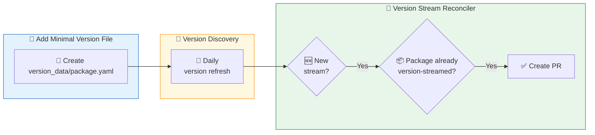

# Version Data

This directory contains version data files that track upstream software releases for packages maintained by Chainguard. This data powers multiple automation systems:

- **Version Discovery**: Daily refresh of upstream version information
- **Version Stream Reconciler**: Automatic creation of new version stream packages
- **Update Bot**: Automatic version bump PRs (coming soon)

## Getting Started

To add a new package to version tracking, create a YAML file named `{package-name}.yaml` with just the package name:

```yaml
name: my-package
```

Commit and push. The version discovery bot will automatically populate the file with metadata, streams, and version history.

## Version Stream Automation

For packages that follow version streaming (e.g., `postgres-17`, `postgres-18`), the diagram below shows how new streams are automatically created:



**Example PRs:**
1. [PR #3145](https://github.com/chainguard-dev/stereo/pull/3145) - Adding minimal version files
2. [PR #3334](https://github.com/chainguard-dev/stereo/pull/3334) - Version discovery populates grafana-pyroscope
3. [PR #8910](https://github.com/chainguard-dev/stereo/pull/8910) - Version stream reconciler creates grafana-pyroscope 1.18

For details on how the Version Stream Reconciler works, see the [package documentation](https://github.com/chainguard-dev/mono/blob/main/bots/version-stream-reconciler/internal/versionstreamreconciler/doc.go). To prevent the bot from overwriting manual changes, apply the `skip:version-stream-reconciler` label.

## File Format

After the bot processes a file, it will have this structure:

```yaml
name: postgres
additional_prompt: Optional hints for the AI agent
metadata:
  release_monitor:
    id: 381406
    name: postgresql
  endoflife:
    name: postgresql
  git_tags:
    - https://github.com/postgres/postgres
streams:
  - stream: "18"
    versions:
      - version: "18.1"
        sources:
          - type: git
            tag: REL_18_1
            tag_uri: https://github.com/postgres/postgres/releases/tag/REL_18_1
            commit: 4b324845ba5d24682b9b3708a769f00d160afbd7
            published_at: 2025-11-10T21:52:06Z
          - type: release_monitor
            tag: "18.1"
```

### Fields

| Field | Description |
|-------|-------------|
| `name` | Package name (required) |
| `additional_prompt` | Optional hints for the AI agent |
| `metadata.release_monitor` | Project info from release-monitoring.org |
| `metadata.endoflife` | Product name on endoflife.date |
| `metadata.git_tags` | Git repositories to monitor for tags |
| `metadata.github_release` | GitHub repositories to monitor for releases |
| `streams[].stream` | Version stream identifier (e.g., "18", "1.28") |
| `streams[].versions[].version` | Specific version number |
| `streams[].versions[].sources` | Where the version was discovered |

### Source Types

| Type | Description |
|------|-------------|
| `git` | Git tag with commit SHA for reproducible builds |
| `github_release` | GitHub release |
| `release_monitor` | release-monitoring.org |
| `endoflife.date` | Version info from endoflife.date API |

## Advanced: Using `additional_prompt`

In rare cases, we can use `additional_prompt` to influence the agent to generate data in a specific way. See [PR #7829](https://github.com/chainguard-dev/stereo/pull/7829) for an example.

### Common Use Cases

**1. Custom stream splitting** - Override the default major.minor stream logic:
```yaml
name: opensearch
additional_prompt: Split version streams by major version only
```

**2. Cross-product streams** - For packages combining two versioned components:
```yaml
name: pgvector
additional_prompt: |
    This is a cross-product of PostgreSQL streams and pgvector versions.
    Streams come from postgresql (e.g., 17, 16, 15, 14).
    Versions come from pgvector releases at https://github.com/pgvector/pgvector
```

**3. Specify source repository** - When the package name doesn't match the repo:
```yaml
name: kayenta
additional_prompt: Use spinnaker/spinnaker repo to find kayenta tags and releases
```

**4. Multi-repo discovery** - Scan multiple repositories:
```yaml
name: adoptium-openjdk
additional_prompt: Look at all jdk* repositories in the adoptium organization
```

**5. Version format normalization** - Control how versions are parsed:
```yaml
name: sigstore-policy-controller
additional_prompt: Use first version number for streams (0.9.0 -> "0"), not "x.y"
```

**6. Disambiguation** - Clarify which project when names are ambiguous:
```yaml
name: backup-restore-operator
additional_prompt: This is Rancher's backup-restore-operator
```

## Notes

**EOL Data:** End-of-life information is not yet included in these files. EOL data (used by the lifecycle bot) is still sourced from [package-version-metadata](https://github.com/chainguard-dev/package-version-metadata) and will be migrated in the future.
